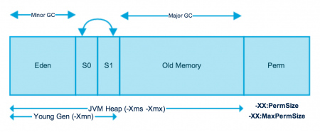

# Memory Management in Java

### Java Heap Space
Java Heap space is used by java runtime to allocate memory to Objects and JRE classes. Whenever we create an object, it’s always created in the Heap space. Garbage Collection runs on the heap memory to free the memory used by objects that don’t have any reference. Any object created in the heap space has global access and can be referenced from anywhere of the application.

### Java Stack Memory
Java Stack memory is used for the execution of a thread. They contain method-specific values that are short-lived and references to other objects in the heap that is getting referred from the method. Stack memory is always referenced in LIFO (Last-In-First-Out) order. Whenever a method is invoked, a new block is created in the stack memory for the method to hold local primitive values and reference to other objects in the method. As soon as the method ends, the block becomes unused and becomes available for the next method. Stack memory size is very less compared to Heap memory.


Let’s understand the Heap and Stack memory usage with a simple program.
```text
public class Program {

	public static void main(String[] args) { // Line 1
		int i=1; // Line 2
		Object obj = new Object(); // Line 3
		Program p = new Program(); // Line 4
		p.foo(obj); // Line 5
	} // Line 9

	private void foo(Object param) { // Line 6
		String str = param.toString(); //// Line 7
		System.out.println(str);
	} // Line 8

}
```

Let’s go through the steps of the execution of the program.

* As soon as we run the program, it loads all the Runtime classes into the Heap space. When the main() method is found at line 1, Java Runtime creates stack memory to be used by main() method thread.
* We are creating primitive local variable at line 2, so it’s created and stored in the stack memory of main() method.
* Since we are creating an Object in the 3rd line, it’s created in heap memory and stack memory contains the reference for it. A similar process occurs when we create Memory object in the 4th line.
* Now when we call the foo() method in the 5th line, a block in the top of the stack is created to be used by the foo() method. Since **Java is pass-by-value**, a new reference to Object is created in the foo() stack block in the 6th line.
* A string is created in the 7th line, it goes in the String Pool in the heap space and a reference is created in the foo() stack space for it.
* foo() method is terminated in the 8th line, at this time memory block allocated for foo() in stack becomes free.
* In line 9, main() method terminates and the stack memory created for main() method is destroyed. Also, the program ends at this line, hence Java Runtime frees all the memory and ends the execution of the program.




As you can see in the above image, JVM memory is divided into separate parts., **JVM Heap and Perm.**

JVM Heap memory is further divided into two parts – **Young Generation** and **Old Generation**.

**Young generation** is the place where all the new objects are created. **When young generation is filled, garbage collection is performed**.   
This garbage collection is called Minor GC. Young Generation is divided into three parts – **Eden Memory and two Survivor Memory spaces**.

Important Points about Young Generation Spaces:
* Most of the newly created objects are located in the Eden memory space.
* When Eden space is filled with objects, Minor GC is performed and all the survivor objects are moved to one of the survivor spaces.
* Minor GC also checks the survivor objects and move them to the other survivor space. So, **at a time one of the survivor space is always empty**.
* Objects that survive after many cycles of GC, are moved to the Old generation memory space. Usually it’s done by setting a threshold for the age of the young generation objects before they become eligible to promote to Old generation.

**Old Generation** memory contains the objects that are long-lived and survived after many rounds of Minor GC. Usually garbage collection is performed in Old Generation memory when it’s full. Old Generation Garbage Collection is called **Major GC** and usually takes longer time.

**All the Garbage Collections are “Stop the World” events because all application threads are stopped until the operation completes.**
Since Young generation keeps short-lived objects, Minor GC is very fast and the application doesn’t get affected by this.

However, Major GC takes longer time because it checks all the live objects. Major GC should be minimized because it will make your application unresponsive for the garbage collection duration. So if you have a responsive application and there are a lot of Major Garbage Collection happening, you will notice timeout errors.

The duration taken by garbage collector depends on the strategy used for garbage collection. That’s why it’s necessary to monitor and tune the garbage collector to avoid timeouts in the highly responsive applications.

**Permanent Generation or “Perm Gen”** contains the application metadata required by the JVM to describe the classes and methods used in the application.   
Note that Perm Gen is not part of Java Heap memory.

Perm Gen is populated by JVM at runtime based on the classes used by the application. Perm Gen also contains Java library classes and methods. **Perm Gen objects are garbage collected in a full garbage collection**.

Parts of Perm Gen
 * **Method Area** is part of space in the Perm Gen and used to store class structure (runtime constants and static variables) and code for methods and constructors.
 * **Memory Pools** are created by JVM memory managers to create a pool of immutable objects, if implementation supports it. String Pool is a good example of this kind of memory pool. Memory Pool can belong to Heap or Perm Gen, depending on the JVM memory manager implementation.
 * **Runtime constant pool** is per-class runtime representation of constant pool in a class. It contains class runtime constants and static methods. Runtime constant pool is the part of method area.
 

# Java Stack Memory
Java Stack memory is used for execution of a thread. They contain method specific values that are short-lived and references to other objects in the heap that are getting referred from the method


#Java Garbage Collection
Java Garbage Collection is the process to identify and remove the unused objects from the memory and free space to be allocated to objects created in the future processing. 

One of the best feature of java programming language is the automatic garbage collection, unlike other programming languages such as C where memory allocation and deallocation is a manual process.

Garbage Collector is the program running in the background that looks into all the objects in the memory and find out objects that are not referenced by any part of the program. All these unreferenced objects are deleted and space is reclaimed for allocation to other objects.

One of the basic way of garbage collection involves three steps:
* Marking: This is the first step where the garbage collector identifies which objects are in use and which ones are not in use.
* Normal Deletion: Garbage Collector removes the unused objects and reclaim the free space to be allocated to other objects.
* Deletion with Compacting: For better performance, after deleting unused objects, all the survived objects can be moved to be together. This will increase the performance of allocation of memory to newer objects.

There are two problems with the simple mark and delete approach.
* First one is that it’s not efficient because most of the newly created objects will become unused
* Secondly objects that are in-use for multiple garbage collection cycle are most likely to be in-use for future cycles too.

The above shortcomings with the simple approach is the reason that Java Garbage Collection is Generational and we have Young Generation and Old Generation spaces in the heap memory. I have already explained above how objects are scanned and moved from one generational space to another based on the Minor GC and Major GC.

Java 8: PermGen space which was part of Heap is removed in Java8 and is now called Metaspace.


##Java Garbage Collection Types
There are five types of garbage collection types that we can use in our applications. We just need to use JVM switch to enable the garbage collection strategy for the application. Let’s look at each of them one by one.
* **Serial GC** (-XX:+UseSerialGC): Serial GC uses the simple mark-sweep-compact approach for young and old generations garbage collection i.e Minor and Major GC.  
Serial GC is useful in client-machines such as our simple stand alone applications and machines with smaller CPU. It is good for small applications with low memory footprint.
* **Parallel GC** (-XX:+UseParallelGC): Parallel GC is same as Serial GC except that is spawns N threads for young generation garbage collection where N is the number of CPU cores in the system. We can control the number of threads using -XX:ParallelGCThreads=n JVM option.  
Parallel Garbage Collector is also called throughput collector because it uses multiple CPUs to speed up the GC performance. Parallel GC uses single thread for Old Generation garbage collection.
* **Parallel Old GC** (-XX:+UseParallelOldGC): This is same as Parallel GC except that it uses multiple threads for both Young Generation and Old Generation garbage collection.
* **Concurrent Mark Sweep (CMS) Collector** (-XX:+UseConcMarkSweepGC): CMS Collector is also referred as concurrent low pause collector. It also does the garbage collection for Old generation. CMS collector tries to minimize the pauses due to garbage collection by doing most of the garbage collection work concurrently with the application threads.  
CMS collector on young generation uses the same algorithm as that of the parallel collector. This garbage collector is suitable for responsive applications where we can’t afford longer pause times. We can limit the number of threads in CMS collector using -XX:ParallelCMSThreads=n JVM option.
* **G1 Garbage Collector** (-XX:+UseG1GC): The Garbage First or G1 garbage collector is available from Java 7 and it’s long term goal is to replace the CMS collector. The G1 collector is a parallel, concurrent, and incrementally compacting low-pause garbage collector.  
Garbage First Collector doesn’t work like other collectors and there is **no concept of Young and Old generation space**. It divides the heap space into multiple equal-sized heap regions. When a garbage collection is invoked, it first collects the region with lesser live data, hence “Garbage First”.

### G1 Garbage Collector Heap Layout
G1 partitions the heap into a set of equally sized heap regions, each a contiguous range of virtual memory as shown below.  
A region is the unit of memory allocation and memory reclamation. At any given time, each of these regions can be empty (light gray), or assigned to a particular generation, young or old.  
As requests for memory comes in, the memory manager hands out free regions. The memory manager assigns them to a generation and then returns them to the application as free space into which it can allocate itself.


